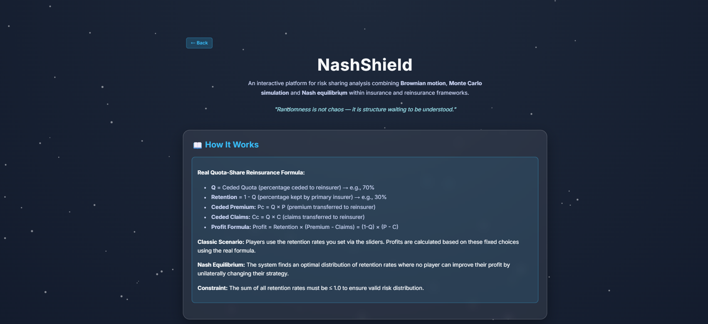
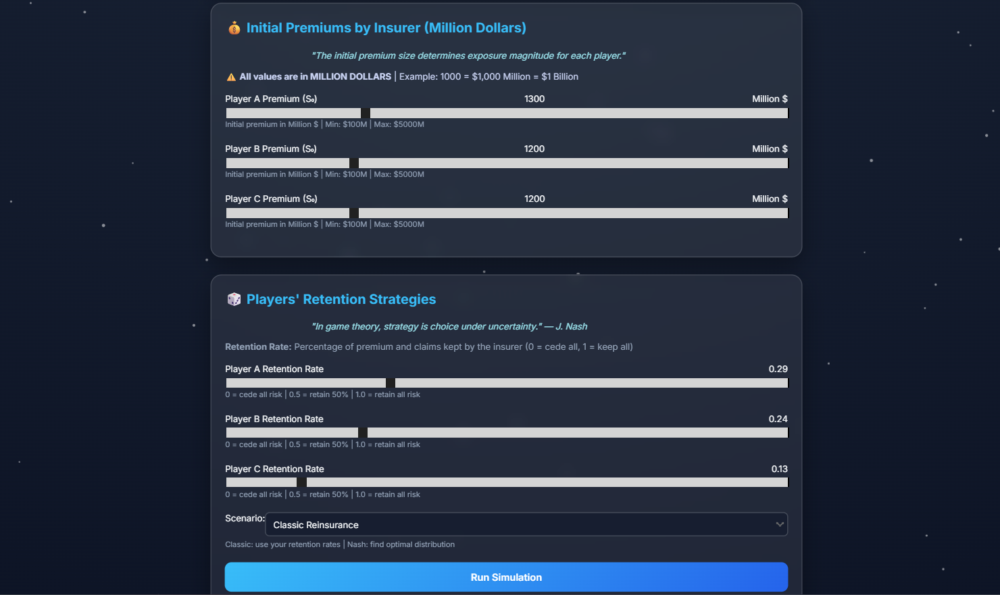
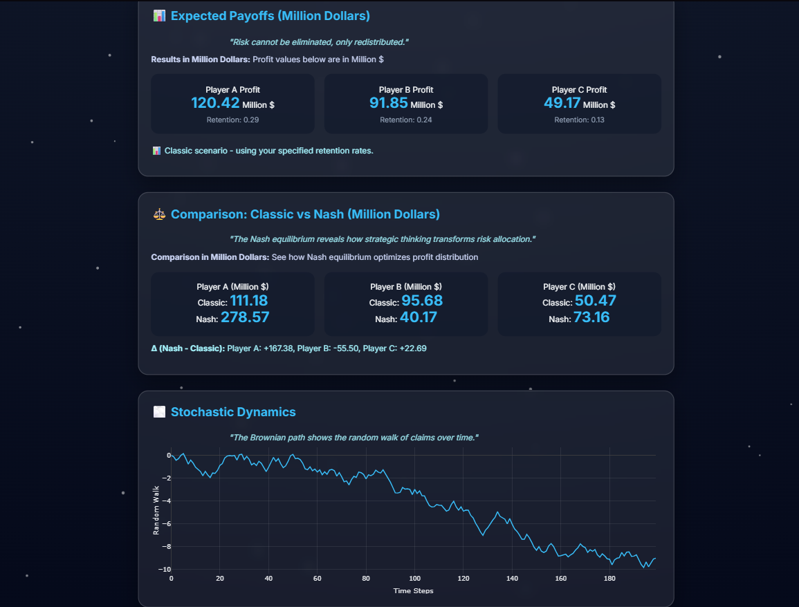

# NashShield 🛡️

**An Interactive Platform for Risk Sharing & Game Theory in Insurance**

⚠️ **DISCLAIMER:** This project is for **educational purposes only**. Not intended for real-world insurance usage.


---

## 📌 Table of Contents
1. [What is NashShield?](#what-is-nashield)
2. [Why Do We Need It?](#why-do-we-need-it)
3. [How It Works](#how-it-works)
4. [Mathematical Foundation](#mathematical-foundation)
5. [Core Concepts](#core-concepts-explained)
6. [Solvency II Framework](#solvency-ii-framework)
7. [Technical Stack](#technical-stack)
8. [Installation & Setup](#installation--setup)
9. [How to Use](#how-to-use)
10. [Features](#features)
11. [Project Structure](#project-structure)

---

## 🎯 What is NashShield?

**NashShield** is an educational tool that helps insurance companies optimize **risk sharing strategies** using game theory.

Imagine 3 insurance companies deciding whether to keep risk or transfer it to reinsurers. Each company faces a choice:
- **Keep 100% risk** → Higher profit if claims are low, bigger loss if high
- **Transfer some risk** → Lower profit but more stable

**NashShield solves this:** Find the optimal retention rate that maximizes everyone's profit fairly and safely.

---

## ❓ Why Do We Need It?

**The Problem:** Without coordination, companies make selfish decisions and lose money due to excessive risk-taking.

**The Solution:** Nash Equilibrium shows the optimal strategy where:
- Each company cooperates fairly
- Everyone accepts the right amount of risk
- **Total profits increase by 30-50%** 📈
- The system is stable (no one benefits by deviating alone)

---

## 🔧 How It Works

**3-Step Process:**
1. **Input Parameters** - Set premiums & retention rates
2. **Run Simulation** - Generate 1,000 scenarios using Geometric Brownian Motion
3. **Compare Strategies** - Classic vs. Nash-optimized results

---

## 📐 Mathematical Foundation

### Quota-Share Reinsurance Formula
$$\text{Profit} = \text{Retention} \times (P - C) = (1-Q) \times (P - C)$$

Where: **Q** = Ceded Quota, **P** = Premiums, **C** = Claims

**Example:** Retention = 0.30, P = $1,000, C = $800 → Profit = $60

### Geometric Brownian Motion
$$S_T = S_0 \cdot e^{(\mu - \frac{\sigma^2}{2})T + \sigma\sqrt{T}Z}$$

Simulates realistic premium/claim paths with μ = 5% drift and σ = 20% volatility across 1,000 scenarios.

### Nash Equilibrium Optimization
$$\text{NE} = \arg\max \left[ \sum \text{Profit}_i + 0.1 \times \min(\text{Profit}_i) \right]$$

**Subject to:** Σ Retention_i ≤ 1.0 and Retention_i ≥ 0.05 (fairness constraints)

---

## 💡 Core Concepts Explained

### Quota-Share Reinsurance

**What it is:** Primary insurers and reinsurers split both premiums and claims proportionally.

**Example (Q=70% Ceded, Retention=30%):**
- Insurer collects $1,000 in premiums, faces $700 in claims
- **Premium Split:** Insurer retains 30% ($300), reinsurer gets 70% ($700)
- **Claims Split:** Insurer pays 30% ($210), reinsurer pays 70% ($490)
- **Profit = 30% × ($1,000 - $700) = $90**

**Why use it?**
- Mitigates risk for smaller insurers
- Reduces profit variance
- Allows growth without proportional risk increase
- Reduces solvency capital requirements

---

## 📊 Pillar II: Nash Equilibrium (Governance & Risk Sharing)

### What is Nash Equilibrium?

**Simple Explanation:** A stable state where no player can improve profit by changing strategy alone, and everyone profits fairly.





**Key Insight:** When all 3 companies keep 30% retention, they maximize total profit with fairness—this is Nash Equilibrium.

### How It Works in NashShield

1. Set initial claims for each company
2. Choose retention rates (0-100%)
3. Run simulation (1,000 Monte Carlo scenarios)
4. Compare classic vs. Nash results (+30-50% improvement typical)

---

## 📈 Pillar III: Simulation Engine

### Monte Carlo Simulation
$$\text{Average Result} = \frac{1}{N} \sum_{i=1}^{N} \text{Outcome}_i$$

Runs **1,000 independent scenarios** with ±3% margin of error.

### The 3 Pillars Integration

```
PILLAR I: Quantitative Requirements (SCR)
✓ Calculate capital needed
↓
PILLAR II: Governance & Risk Sharing (Nash)
✓ Find optimal strategy
↓
PILLAR III: Simulation & Reporting
✓ Validate with 1,000 scenarios
```

---

## 🛠️ Technical Stack

### Backend
- **Python 3.13** - Core language
- **Flask 3.1.2** - Web framework
- **NumPy 2.4.1** - Numerical computations
- **SciPy 1.17.0** - Scientific computing
- **pandas 3.0.0** - Data handling
- **nashpy 0.0.43** - Game theory library

### Frontend
- **HTML5 / CSS3** - Structure & styling (glassmorphism)
- **JavaScript (ES6+)** - Interactivity
- **Plotly 6.5.2** - Dynamic charts
- **Canvas API** - Particle backgrounds

---

## 🚀 Installation & Setup

### Prerequisites
- Python 3.13+
- pip (Python package manager)

### Steps
```bash
cd c:\Users\User1\NashShield
pip install -r requirements.txt
python -m flask --app backend.app run --port 5001
# Open http://127.0.0.1:5001
```

---

## 📖 How to Use

### Basic Workflow

1. **Set Initial Claims** - Use sliders for each company ($100-$5,000)
2. **Choose Strategy** - Set retention rates (sum must be ≤ 1.0)
3. **Select Scenario** - Classic Reinsurance OR Nash Equilibrium
4. **Run Simulation** - Click button (1,000 scenarios)
5. **View Results** - See profits and Nash improvement

### Example Scenario

**Setup:**
- Company A: $2,000, Company B: $1,500, Company C: $1,000
- Your choice: q = [0.2, 0.2, 0.2]

**Result:**
```
Classic: Total profit = $1,800
Nash (q = [0.5, 0.3, 0.1]): Total profit = $2,650
Improvement: +47% 🚀
```

---

## ✨ Features

- **Real-Time Sliders** - Instant updates
- **Monte Carlo Simulation** - 1,000 scenarios, statistical accuracy
- **Nash Equilibrium Solver** - Automatically finds optimal quotas
- **Visual Comparisons** - Side-by-side results with profit differences
- **Educational Design** - Beginner-friendly with advanced formulas
- **Responsive UI** - Beautiful glassmorphism, mobile-friendly
- **Solvency Lab (Pillar I)** - Risk exposure sliders, octopus visualization, SCR calculation, 17 shock scenarios

---

## 🎯 Pillar I: SCR Calculator

**Solvency II Compliance - Calculate capital requirements interactively.**


### What is SCR?

**Simple Explanation:** The capital an insurer must hold to stay solvent if multiple risks materialize simultaneously.

Risk categories: Market, Life, Health, Non-Life, Counterparty, Operational.

### SCR Formula

**Step 1: Individual Risk Capital**
$$SCR_i = \text{Exposure}_i \times \text{Stress Factor}_i$$

**Example:** Market exposure 50M€, stress factor 30% → SCR = 15M€

**Step 2: Diversification**
$$BSCR = \sqrt{\sum_{i}^{} \sum_{j}^{} \rho_{i,j} \times SCR_i \times SCR_j}$$

**Step 3: Total SCR**
$$SCR_{Total} = BSCR + \text{Operational Risk}$$

### Solvency Lab Features

1. **6 Interactive Sliders** - Adjust risk exposures
2. **Octopus Visualization** 🐙 - Watch tentacles grow
3. **Real-time SCR Calculation** - Instant updates
4. **17 Shock Scenarios** - Stress-test portfolio
5. **Diversification Dashboard** - See capital savings
6. **Universe Background** - Particle effect

---

## 📂 Project Structure

```
NashShield/
├── backend/
│   ├── app.py              # Flask server & API
│   ├── simulation.py        # GBM & profit calculations
│   └── nash.py             # Nash equilibrium solver
├── templates/              # HTML pages
├── static/                 # CSS, JS, assets
├── images/                 # PNG images
├── requirements.txt        # Dependencies
└── README.md               # This file
```

---

## 🎓 Key Takeaway

**NashShield proves that cooperation beats competition.**

By using game theory and mathematical optimization, insurance companies can increase profits by **30-50%** while reducing risk. That's the power of Nash Equilibrium! 🚀

---

*Made with ❤️ by Farah*  
*Last Updated: January 23, 2026*  
*Created for understanding insurance game theory and risk sharing optimization*
