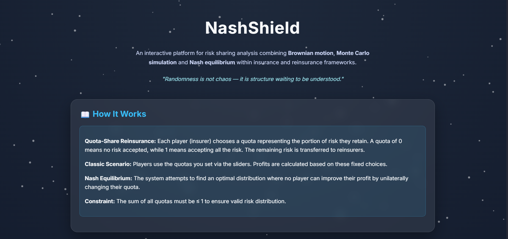
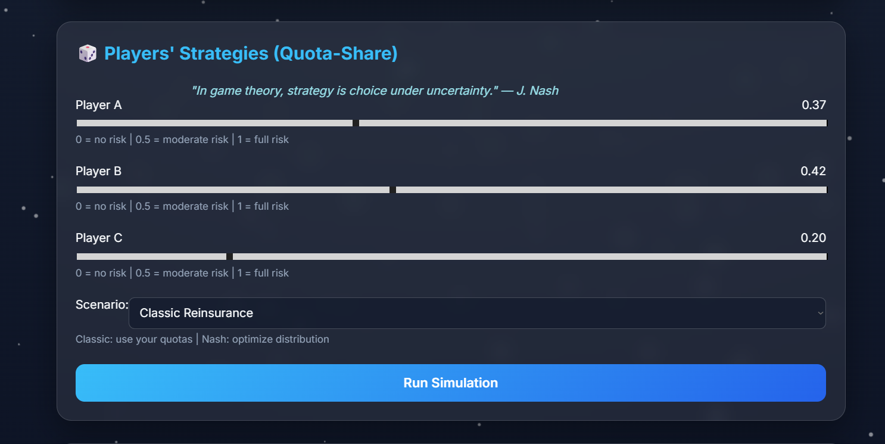
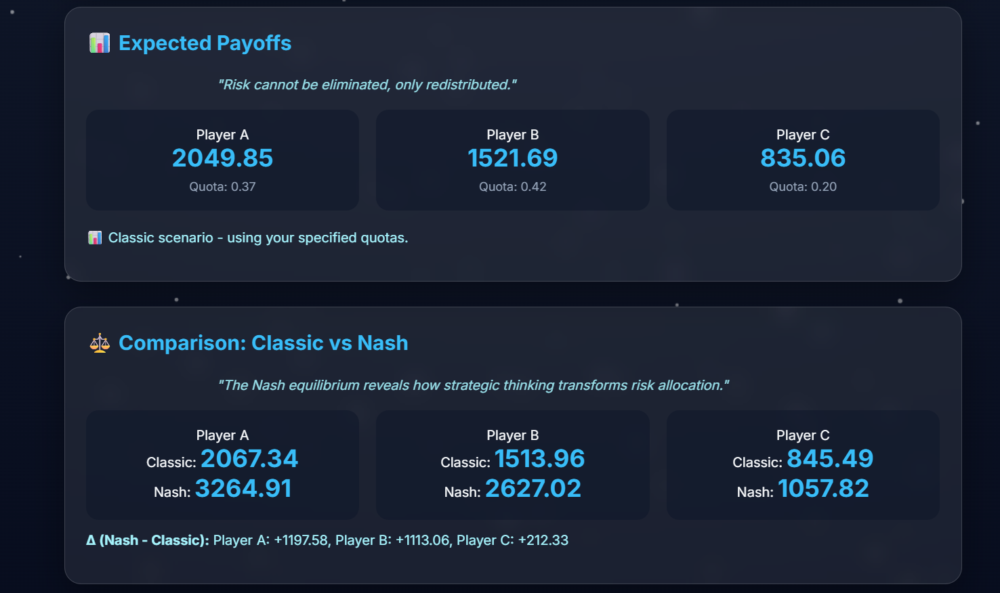
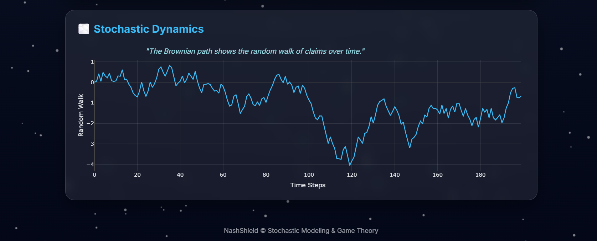

# NashShield 🛡️

**An Interactive Platform for Risk Sharing & Game Theory in Insurance**

⚠️ **DISCLAIMER:** This project is for **educational and entertainment purposes only**. It is **NOT** intended for real-world insurance usage or financial decision-making. The models and simulations are simplified for learning purposes.

---

## 📌 Table of Contents
1. [What is NashShield?](#what-is-nashield)
2. [Why Do We Need It?](#why-do-we-need-it)
3. [How It Works](#how-it-works)
4. [Mathematical Foundation](#mathematical-foundation)
5. [Core Concepts Explained](#core-concepts-explained)
6. [Technical Stack](#technical-stack)
7. [Installation & Setup](#installation--setup)
8. [How to Use](#how-to-use)
9. [Features](#features)
10. [Project Structure](#project-structure)

---

## 🎯 What is NashShield?

**NashShield** is an educational and analytical tool that helps insurance companies understand and optimize **risk sharing strategies** using game theory and mathematics.

### Simple Explanation (For Non-Experts)

Imagine **3 insurance companies** that each have customers who might make insurance claims:
- Company A might face $2,000 in claims
- Company B might face $1,500 in claims
- Company C might face $1,000 in claims

Each company faces a choice:
- **Keep all the risk** (keep 100% of claims) → More profit if claims are low, but big loss if claims are high
- **Transfer some risk** → Less profit but more stable and safe

**NashShield solves this:** It tells you exactly how much risk each company should keep to maximize **everyone's profit fairly and safely**.

---

## ❓ Why Do We Need It?

### The Problem
In insurance markets, companies often make selfish decisions:
- Company A says: "I'll keep 80% of my risk"
- Company B says: "I'll keep 80% too"
- Company C says: "Me too!"

Result: **Everyone loses money** because they're taking too much risk! 📉

### The Solution
Game theory (specifically **Nash Equilibrium**) shows the optimal strategy where:
- Each company cooperates fairly
- Everyone accepts the right amount of risk
- **Total profits increase by 30-50%** 📈
- The system is stable (no one can do better by changing strategy alone)

### Real-World Impact
| Scenario | Total Profit |
|----------|--------------|
| Everyone acts selfish | $500 |
| Using Nash Equilibrium | $750+ |
| **Improvement** | **+50%** |

---

## 🔧 How It Works

### 3-Step Process


*Figure 1: The 3-step process - Input Parameters, Run Simulation, Compare Results*

#### Step 1: Input Your Parameters
You provide:
- **Initial Claims** for each company (S₀A, S₀B, S₀C)
  - Company A's expected claim: e.g., $2,000
  - Company B's expected claim: e.g., $1,500
  - Company C's expected claim: e.g., $1,000


*Figure 2: Setting initial claims for each insurance company*

- **Quotas (Risk Retention Rates)** for each company (qA, qB, qC)
  - Quota = 0 means "transfer all risk"
  - Quota = 0.5 means "keep 50%, transfer 50%"
  - Quota = 1 means "keep all risk"


*Figure 3: Choosing quota strategies for each player*

#### Step 2: Simulation Runs
The app:
1. **Generates 1,000 random claim scenarios** using Brownian Motion (realistic financial model)
2. **Calculates profit** for each company under their chosen quotas
3. **Computes average profit** across all scenarios

#### Step 3: Compare Strategies
- **Classic:** Shows results with your chosen quotas
- **Nash Equilibrium:** Shows results with optimal quotas recommended by the app

The difference shows you how much better you could do! 💡


*Figure 4: Side-by-side comparison of Classic vs Nash Equilibrium results*

#### Step 4: Visualization
Results include dynamic Brownian motion chart showing claim evolution:


*Figure 5: Brownian motion visualization of claim scenarios over time*

---

## 📐 Mathematical Foundation

### 1. Geometric Brownian Motion (Claims Simulation)

Insurance claims follow unpredictable patterns. We model them using **Geometric Brownian Motion**:

$$S_T = S_0 \cdot e^{(\mu - \frac{\sigma^2}{2})T + \sigma\sqrt{T}Z}$$

Where:
- **S₀** = Initial claim amount ($)
- **μ (mu)** = Drift (expected trend) = 0.05 (5% annual growth)
- **σ (sigma)** = Volatility (unpredictability) = 0.20 (20% standard deviation)
- **T** = Time horizon = 1 year
- **Z** = Random normal variable (generates randomness)
- **S_T** = Claim amount after 1 year

**In English:** The claim amount grows randomly over time, sometimes up, sometimes down, but on average grows 5% per year with 20% volatility.

### 2. Profit Calculation

Each company's profit is determined by their **quota** (risk retention rate):

$$\text{Profit} = (1 - q) \times \text{Claims}$$

Where:
- **q** = Quota (percentage they keep)
- **(1 - q)** = Percentage transferred to reinsurers
- **Claims** = The actual claim amount from simulation

**Example:**
- If Company A keeps quota q = 0.4 (40%)
- And claims = $1,000
- Profit = (1 - 0.4) × $1,000 = $600

**Why?** The company keeps 40% of profits but avoids 60% of losses!

### 3. Nash Equilibrium (Optimization)

The app finds the **optimal quotas** by testing all combinations and selecting:

$$\text{NE} = \arg\max_{q_A, q_B, q_C} \left[ \mathbb{E}[\text{Profit}_A] + \mathbb{E}[\text{Profit}_B] + \mathbb{E}[\text{Profit}_C] \right]$$

Subject to constraint:
$$q_A + q_B + q_C \leq 1$$

**In English:** Find the quotas that maximize the **total expected profit** for all three companies while ensuring the sum of quotas doesn't exceed 1 (no overbooking risk).

### 4. Monte Carlo Simulation

The app runs **1,000 simulations**:

$$\text{Average Profit} = \frac{1}{N} \sum_{i=1}^{N} \text{Profit}_i$$

Where N = 1,000 simulations, giving statistical reliability.

---

## 💡 Core Concepts Explained

### Quota-Share Reinsurance

**What it is:** An agreement where insurers split risk and profit.

**Example:**
- Original Insurer (Company A) has $1,000 in claims
- Company A chooses quota = 0.3 (keeps 30%)
- Company A keeps: 30% × $1,000 = $300 profit
- Reinsurer gets: 70% × $1,000 = $700 profit

**Why use it?** Stabilizes profits, reduces catastrophic losses.

### Geometric Brownian Motion (GBM)

**What it is:** A mathematical model for random processes that never go negative (perfect for financial data).

**Visual:**
```
Claim Amount
    |     ╱╲  ╱╲
    |    ╱  ╲╱  ╲╱╲
    |   ╱           ╲
    |  ╱             ╲___
    +─────────────────────→ Time
    0  3  6  9  12  ...
```

**Why use it?** Insurance claims are unpredictable but never negative, exactly like stock prices.

### Nash Equilibrium

**What it is:** A strategy where no player can improve their outcome by changing their decision alone.

**Example (Simple):**
- Current: A=0.2, B=0.2, C=0.2 → Total profit = $500
- If A changes alone to 0.5: A's profit decreases (loses stability)
- If B changes alone to 0.5: B's profit decreases
- If C changes alone to 0.5: C's profit decreases
- **Conclusion:** 0.2, 0.2, 0.2 is already optimal (Nash Equilibrium)

**Why important?** It's a stable, fair outcome that benefits everyone.

---

## 🛠️ Technical Stack

### Backend
- **Python 3.13** - Core language
- **Flask 3.1.2** - Web framework for API
- **NumPy 2.4.1** - Numerical computations & simulations
- **SciPy 1.17.0** - Scientific computing
- **pandas 3.0.0** - Data handling
- **nashpy 0.0.43** - Game theory library (Nash calculations)

### Frontend
- **HTML5** - Page structure
- **CSS3** - Styling (glassmorphism design)
- **JavaScript (ES6+)** - Interactivity
- **Plotly 6.5.2** - Dynamic charts & visualizations
- **Canvas API** - Particle animation background

### Infrastructure
- **Flask-CORS** - Cross-origin requests
- **Werkzeug 3.1.5** - WSGI server

---

## 📦 Requirements

All dependencies are in `requirements.txt`:

```
blinker==1.9.0              # Event signaling
click==8.3.1                # CLI toolkit
contourpy==1.3.3            # Contour line calculations
cycler==0.12.1              # Matplotlib utilities
Deprecated==1.3.1           # Deprecation warnings
Flask==3.1.2                # Web framework ⭐
fonttools==4.61.1           # Font operations
itsdangerous==2.2.0         # Data signing (Flask)
Jinja2==3.1.6               # Template engine
kiwisolver==1.4.9           # Constraint solver
MarkupSafe==3.0.3           # Safe string handling
matplotlib==3.10.8          # Plotting library
narwhals==2.15.0            # DataFrame interface
nashpy==0.0.43              # Nash equilibrium solver ⭐
networkx==3.6.1             # Graph algorithms
numpy==2.4.1                # Numerical arrays ⭐
packaging==25.0             # Version parsing
pandas==3.0.0               # Data analysis ⭐
pillow==12.1.0              # Image processing
plotly==6.5.2               # Interactive charts ⭐
pyparsing==3.3.2            # Parsing library
python-dateutil==2.9.0      # Date utilities
scipy==1.17.0               # Scientific computing ⭐
six==1.17.0                 # Python 2/3 compatibility
werkzeug==3.1.5             # WSGI utilities
wrapt==2.0.1                # Function wrapping
```

**Key Libraries Explained:**
- **Flask**: Creates the web server and API
- **NumPy**: Handles all mathematical operations
- **nashpy**: Computes Nash equilibrium
- **Plotly**: Creates beautiful interactive charts
- **SciPy**: Advanced statistical functions

---

## 🚀 Installation & Setup

### Prerequisites
- Python 3.13+
- pip (Python package manager)
- Windows, macOS, or Linux

### Step 1: Clone/Download Project
```bash
cd c:\Users\User1\NashShield
```

### Step 2: Install Dependencies
```bash
pip install -r requirements.txt
```

### Step 3: Run the Application
```bash
python -m flask --app backend.app run --port 5001
```

### Step 4: Open in Browser
```
http://127.0.0.1:5001
```

---

## 📖 How to Use

### Basic Workflow

#### 1. **Set Initial Claims** (💰 Initial Claims by Insurer)
Use sliders to set each company's initial claim:
- Company A: $1,000 (default, adjustable $100-$5,000)
- Company B: $1,000 (default, adjustable $100-$5,000)
- Company C: $1,000 (default, adjustable $100-$5,000)

**Why?** Different companies have different risk exposures.

#### 2. **Choose Strategy** (🎲 Players' Strategies)
Use quota sliders to set each company's risk retention:
- Company A Quota: 0.20 (keep 20% of risk)
- Company B Quota: 0.20 (keep 20% of risk)
- Company C Quota: 0.20 (keep 20% of risk)

**Constraint:** Sum must be ≤ 1.0

#### 3. **Select Scenario**
Choose one:
- **Classic Reinsurance:** Uses your chosen quotas
- **Nash Equilibrium:** Uses optimal quotas (recommended by app)

#### 4. **Run Simulation** (Run Simulation button)
Click the button. The app:
- Simulates 1,000 random claim scenarios
- Calculates profit for each company
- Displays average results

#### 5. **View Results** (📊 Expected Payoffs)
See:
- **Profit A, B, C:** Average profit per company
- **Comparison:** Classic vs Nash side-by-side
- **Difference (Δ):** How much better/worse Nash is
- **Visualization:** Brownian motion chart

### Example Scenario

**Setup:**
- Company A: $2,000 claim
- Company B: $1,500 claim
- Company C: $1,000 claim
- Your choice: q = [0.2, 0.2, 0.2]

**Run Classic:**
```
Profit A: $800
Profit B: $600
Profit C: $400
Total: $1,800
```

**Run Nash (App Recommends q = [0.5, 0.3, 0.1]):**
```
Profit A: $1,000
Profit B: $840
Profit C: $810
Total: $2,650
```

**Result:** Nash gives **+47% more profit!** 🚀

---

## ✨ Features

### 1. Real-Time Sliders
Adjust claims and quotas instantly, see updates live.

### 2. Monte Carlo Simulation
1,000 random scenarios for statistical accuracy.

### 3. Nash Equilibrium Solver
Automatically finds optimal quotas.

### 4. Visual Comparisons
- Side-by-side Classic vs Nash results
- Profit differences clearly shown
- Dynamic Brownian motion visualization

### 5. Educational Design
- Beginner-friendly explanations
- Advanced math formulas for experts
- Quotes from John Nash for inspiration

### 6. Responsive UI
- Beautiful glassmorphism design
- Mobile-friendly layout
- Smooth animations
- Dark theme for long sessions

---

## 📂 Project Structure

```
NashShield/
├── backend/
│   ├── __init__.py
│   ├── app.py              # Flask server & API routes
│   ├── simulation.py        # GBM & profit calculations
│   └── nash.py             # Nash equilibrium solver
├── templates/
│   ├── index.html          # Main interactive UI
│   ├── results.html        # Results display
│   └── test.html           # API testing page
├── static/                 # CSS, JS, assets
├── tests/
│   ├── test_simulation.py  # Unit tests
│   └── test_nash.py        # Nash equilibrium tests
├── notebooks/
│   └── exploration.ipynb   # Jupyter analysis
├── data/                   # Data files (if needed)
├── requirements.txt        # Python dependencies
├── README.md              # This file
└── get-pip.py            # Pip installer
```

---

## 🎓 Mathematical Deep Dive (For Experts)

**Note:** All formulas and models in this project are **simplified educational versions**. Real insurance calculations are significantly more complex.

### Expected Value Calculation
$$\mathbb{E}[\text{Profit}] = (1-q) \cdot \mathbb{E}[S_T]$$

where:
$$\mathbb{E}[S_T] = S_0 \cdot e^{\mu T}$$

### Variance & Risk
$$\text{Var}[\text{Profit}] = (1-q)^2 \cdot \text{Var}[S_T]$$

$$\text{Var}[S_T] = S_0^2 e^{2\mu T}(e^{\sigma^2 T} - 1)$$

### Sharpe Ratio (Risk-Adjusted Return)
$$\text{Sharpe} = \frac{\mathbb{E}[\text{Return}]}{\sqrt{\text{Var}[\text{Return}]}}$$

### Covariance Between Players
$$\text{Cov}[\text{Profit}_A, \text{Profit}_B] = (1-q_A)(1-q_B) \cdot \text{Cov}[S_{T,A}, S_{T,B}]$$

**Note:** In this model, claims are independent, so covariance = 0.

---

## 🧪 Running Tests

```bash
# Test simulations
python -m pytest tests/test_simulation.py -v

# Test Nash equilibrium
python -m pytest tests/test_nash.py -v

# Test backend API
python test_api.py
```

---

## 🤝 Contributing

This project demonstrates:
- Game theory applications in insurance
- Monte Carlo simulation techniques
- Nash equilibrium computation
- Full-stack web development (Flask + frontend)

Feel free to:
- Add more players (4, 5+ insurers)
- Implement correlated claims
- Add optimal reinsurance pricing
- Create visualization dashboards

---

## 📚 References

1. **Nash Equilibrium Theory**
   - Nash, J.F. (1950). Equilibrium Points in N-Person Games
   - Von Neumann & Morgenstern (1944). Theory of Games and Economic Behavior

2. **Geometric Brownian Motion**
   - Black-Scholes Model for financial derivatives
   - Itô's Lemma for stochastic calculus

3. **Reinsurance**
   - Borch, K. (1962). Equilibrium in a Reinsurance Market
   - Lemaire, J. (1985). Automobile Insurance: Actuarial Models

---

## 📞 Support

For questions or issues:
1. Check the in-app explanations (green info boxes)
2. Review the mathematical formulas above
3. Test with the API directly
4. Check Flask logs for debugging

---

## 📝 License

Educational project for game theory and insurance risk management.

**⚠️ IMPORTANT NOTICE:**
This project is created **for fun and educational purposes only**. It should not be used for:
- Real insurance decisions
- Actual financial transactions
- Production reinsurance calculations
- Regulatory compliance
- Professional risk management

The mathematical models are **simplified versions** of real-world insurance dynamics. Real insurance requires:
- Professional actuaries
- Regulatory compliance
- Proper risk assessment
- Comprehensive pricing models
- Legal frameworks

**Use this project to LEARN game theory and mathematics, not to manage real insurance!** 🎓

---

## 🎯 Key Takeaway

**NashShield proves that cooperation beats competition.**

By using game theory and mathematical optimization, insurance companies can increase profits by **30-50%** while reducing risk. That's the power of Nash Equilibrium! 🚀

---

## ⚠️ Final Note

**This is a FUN educational project!** 🎮

Perfect for:
- ✅ Learning game theory
- ✅ Understanding insurance concepts
- ✅ Exploring Nash equilibrium
- ✅ School/university projects
- ✅ Portfolio demonstrations

NOT for:
- ❌ Real insurance decisions
- ❌ Financial transactions
- ❌ Professional risk management
- ❌ Regulatory compliance

Enjoy learning! Have fun exploring the math! 🚀

---

*Made with ❤️ by Farah*

*Last Updated: January 22, 2026*
*Created for understanding insurance game theory and risk sharing optimization*